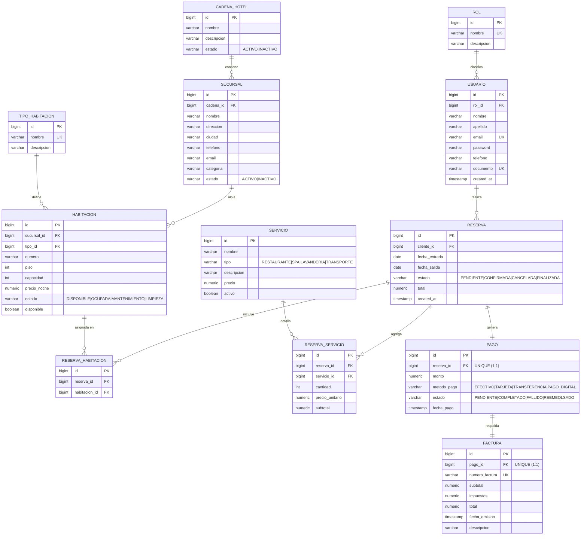

# Modelo Relacional — Sistema de Gestión Hotelera

Diagrama entidad-relación de la base de datos `proyecto_hotel`. Refleja la
migración Flyway `V1__crear_tablas.sql` y las restricciones añadidas en
`V2__restricciones_e_indices.sql`.

## Diagrama ER

## Relaciones

| Origen | Cardinalidad | Destino | Descripción |
|---|---|---|---|
| `cadena_hotel` | 1 : N | `sucursal` | Una cadena tiene varias sucursales |
| `rol` | 1 : N | `usuario` | Un rol agrupa varios usuarios |
| `sucursal` | 1 : N | `habitacion` | Una sucursal aloja varias habitaciones |
| `tipo_habitacion` | 1 : N | `habitacion` | Un tipo clasifica varias habitaciones |
| `usuario` (cliente) | 1 : N | `reserva` | Un cliente realiza varias reservas |
| `reserva` ↔ `habitacion` | N : M | vía `reserva_habitacion` | Reserva de varias habitaciones |
| `reserva` ↔ `servicio` | N : M | vía `reserva_servicio` | Servicios adicionales por reserva |
| `reserva` | 1 : 1 | `pago` | Un pago por reserva (`uq_pago_reserva`) |
| `pago` | 1 : 1 | `factura` | Una factura por pago (`uq_factura_pago`) |

## Normalización y restricciones

- **3FN**: catálogos separados (`rol`, `tipo_habitacion`, `servicio`) y tablas
  puente (`reserva_habitacion`, `reserva_servicio`) eliminan redundancia y
  relaciones N:M directas.
- **Unicidad**: `usuario.email`, `usuario.documento`, `rol.nombre`,
  `tipo_habitacion.nombre`, `(habitacion.sucursal_id, numero)`,
  `factura.numero_factura`.
- **Dominios controlados**: restricciones `CHECK` que reflejan los enums de la
  aplicación (estados, métodos de pago, tipos de servicio).
- **Reglas de negocio**: `fecha_salida > fecha_entrada`, montos y cantidades
  no negativos.
- **Índices** sobre todas las claves foráneas para escalabilidad de consultas.
